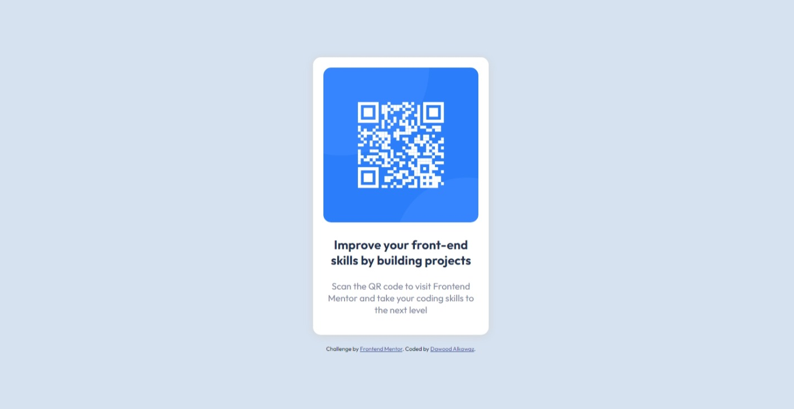

# Frontend Mentor - QR code component solution

This is a solution to the [QR code component challenge on Frontend Mentor](https://www.frontendmentor.io/challenges/qr-code-component-iux_sIO_H).

## Table of contents

- [Overview](#overview)
  - [Screenshot](#screenshot)
- [My process](#my-process)
  - [Built with](#built-with)
  - [What I learned](#what-i-learned)

## Overview

This as the QR code design challenge from [Frontend Mentor](https://www.frontendmentor.io).

### Screenshot

|  |  |
|:-----------------------:|:-----------------------:|
|     Desktop Design  |    Mobile Design  |


## My process

### Built with

- **Flexbox** for centering the content in whatever screen.


### What I learned

Using **Flexbox** makes control of position much easier.
```css
body {
    height: 100vh;
    display: flex;
    flex-direction: column;
    justify-content: center;
    align-items: center;
    gap: 20px;
}
```
